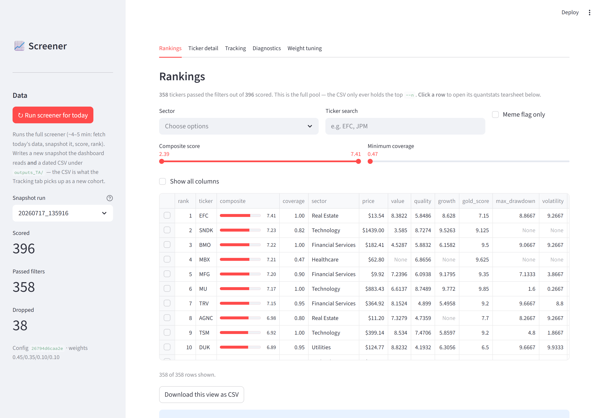
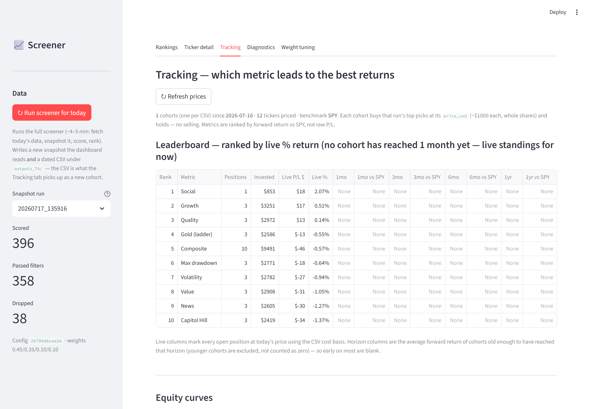
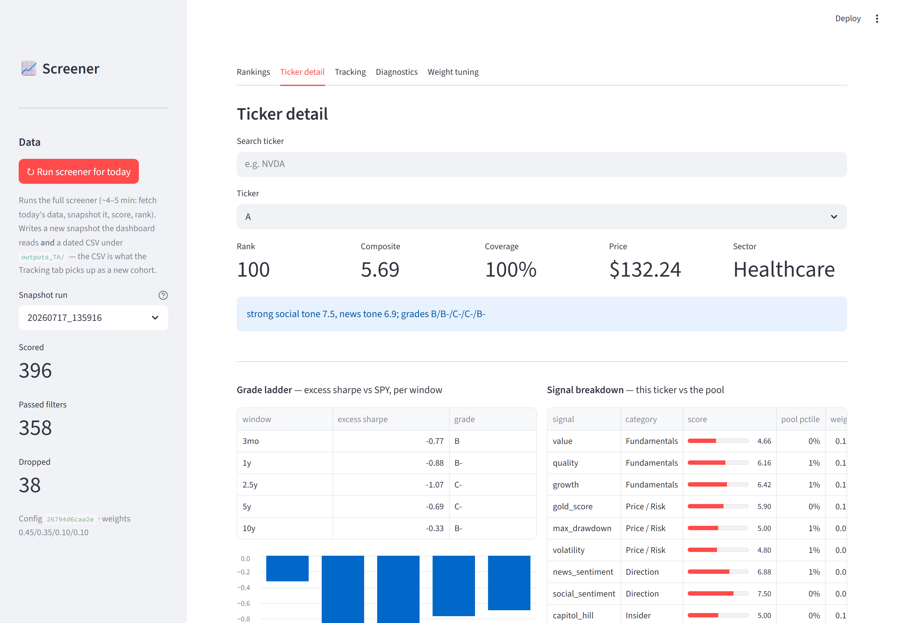
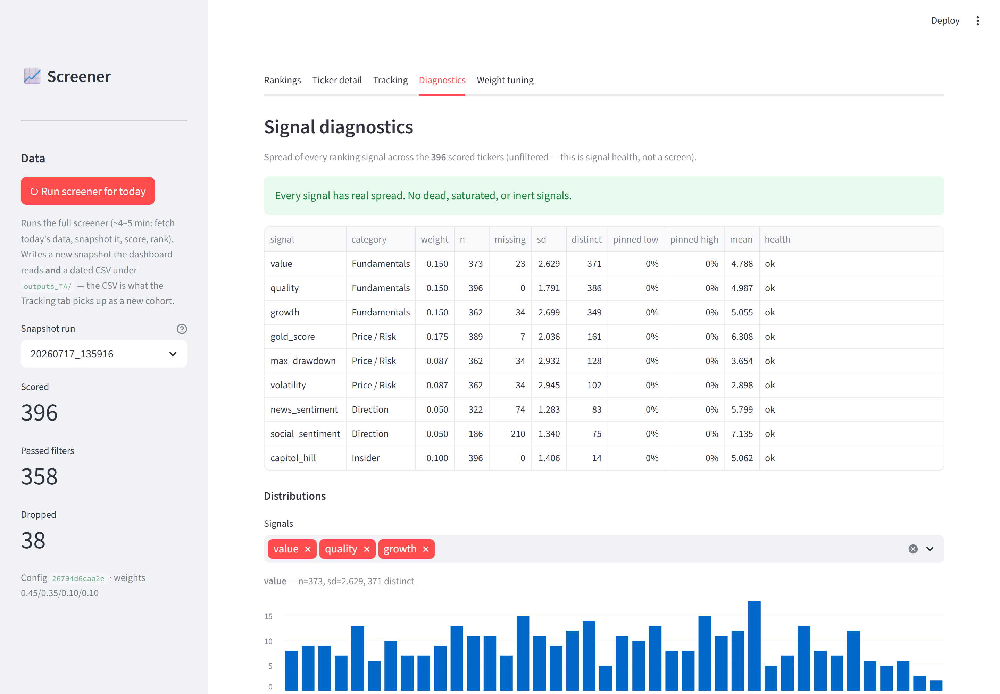

# Market Screener

A deterministic, free-data stock screener built for a **2-year holding horizon**. It seeds a
universe from short-term attention (who's being talked about today), then ranks those names on
fundamentals, risk-adjusted track record, sentiment, and congressional trading — and ships a
Streamlit dashboard with a paper-trading **Tracking** tab that follows each run's top picks forward
to see which signal actually predicts returns.

Design principle throughout: **attention discovers, fundamentals select.** The sources that build
the pool (movers, trending, Reddit) never rank it — weighting them again would count them twice.

---

## Quick start

```bash
# 1. Install (once)
pip install -r market_screener/requirements.txt
playwright install chromium          # crawl4ai's headless browser (Reddit + Capitol Trades)

# 2. Launch the dashboard — works from anywhere
streamlit run market_screener/dashboard/app.py
```

The dashboard opens in your browser. Click **"Run screener for today"** in the sidebar to fetch
today's data and produce a fresh ranking, or explore the snapshot that ships with the repo.

Prefer the command line?

```bash
cd market_screener
python screener.py            # full run: fetch, score, write a dated CSV + print a table
python screener.py --replay   # re-score the newest snapshot with no network (deterministic)
```

See [Usage](#usage) for all flags.

---

## Screenshots

**Rankings** — the full scored pool with the composite bar, filters, and per-signal columns:



**Tracking** — paper-trades each run's top picks per metric and ranks the metrics by forward return
vs SPY (horizon columns fill in as cohorts age):



**Ticker detail** — the grade ladder (excess sharpe vs SPY per window) and each signal vs the pool:



**Diagnostics** — signal health across the pool (spread, distinct values, saturation), so a dead or
saturated signal can't hide:



---

## Table of contents

- [Screenshots](#screenshots)
- [How it works](#how-it-works)
- [Data sources](#data-sources)
- [How each score is calculated](#how-each-score-is-calculated)
- [The composite, coverage, and filters](#the-composite-coverage-and-filters)
- [Usage](#usage)
- [The dashboard & Tracking tab](#the-dashboard--tracking-tab)
- [Requirements & install](#requirements--install)
- [Determinism & replay](#determinism--replay)

---

## How it works

A run has four phases:

1. **Ingest** (the only phase that touches the network) — seed the universe from attention sources,
   fetch prices/fundamentals/news/sentiment/congressional trades, and write it all to a **snapshot**
   on disk (`data/raw/<run_ts>/`, ~46 MB of parquet + JSON).
2. **Score** — a *pure function of the snapshot*: no network, no clock, no threads. Every number is
   reproducible from the snapshot bytes.
3. **Rank + explain** — sort by composite, build a plain-text `reason` from the drivers that moved
   each rank (there is no LLM anywhere in the project).
4. **Output** — write a dated CSV under `outputs_TA/<date>/` and print a table.

The dashboard reads the **snapshot** (the full scored pool), not the CSV. The CSV is a top-`--n`
export that the Tracking tab consumes as a paper-trading cohort.

---

## Data sources

All free, no paid API keys.

### Universe seeding (discovery only — weight 0 in the ranking)

| Source | What it contributes | How |
|---|---|---|
| **Yahoo Finance** movers | most-active / day-gainers / day-losers | `yfinance.screen()` |
| **StockTwits** trending | trending symbols | `trending/symbols.json` (via cloudscraper — plain requests 403s) |
| **Reddit** (8 subreddits, hot + new) | tickers mentioned in post titles | `old.reddit` HTML rendered with crawl4ai (the `.json` API 403s for every client) |
| **Finviz** | unusual-volume / near-52w-high / high-avg-volume names | `finviz` package screener |
| **Ticker whitelist** | ~7,070 valid NYSE/NASDAQ/AMEX symbols to filter junk | GitHub `rreichel3/US-Stock-Symbols`; Wikipedia S&P fallback |

Seeded tickers are ranked by how many sources corroborate them and capped at `seed_pool_size`
(default 400).

### Per-ticker data (feeds the scores)

| Source | Feeds | Notes |
|---|---|---|
| **yfinance** | price history (`max`), fundamentals (`info`) | prices drive the ladder, risk, Monte Carlo |
| **Finviz** | P/E fallback | yfinance P/E coverage is only ~75% |
| **Google News RSS** | headlines for `news_sentiment` + buzz | queried by *quoted company name*, relevance-filtered (a bare ticker is too often an English word) |
| **StockTwits** streams | Bull/Bear labels for `social_sentiment` | `streams/symbol/<T>.json`; budgeted (~200/hr unauth) |
| **Capitol Trades** | congressional buy/sell activity | scraped via crawl4ai |

---

## How each score is calculated

Every ranking signal is mapped to a **0–10** scale. Missing data returns `None` (it renormalizes
away — see [coverage](#the-composite-coverage-and-filters)); it is **never** imputed to a neutral
5.0, so "no data" stays distinguishable from "measured, and average".

Two mapping philosophies, chosen per signal:
- **Percentile** where the signal is a count or ranking with no meaningful zero (a constant threshold
  would rot the moment a feed changes).
- **Absolute** where a real zero exists (excess-return-vs-SPY, sentiment rate) — because percentiles
  throw away *level*, and level is the whole point there.

### Fundamentals — `value`, `quality`, `growth`  (category weight 0.45)

Each is a **sector-relative percentile** (valuation only means something against comparable
companies). Each category averages the underlying ratios the ticker actually has:

| Signal | Underlying ratios (direction) |
|---|---|
| `value` | trailing P/E, price/sales, EV/EBITDA — *lower is better, must be positive* (a loss-maker has no interpretable P/E) |
| `quality` | profit margin ↑, return on equity ↑, debt/equity ↓, current ratio ↑ |
| `growth` | revenue growth ↑, earnings growth ↑ |

Each ratio is turned into a sector percentile (pool-wide fallback if a sector has < 5 names), then
averaged within the category over whatever ratios are present.

### Gold / ladder — `gold_score`  (weight 0.175, half of price/risk)

The headline "is this a real compounder or a pump?" signal. For each of **five windows**
(3mo, 1y, 2.5y, 5y, 10y):

```
excess_sharpe(window) = sharpe(stock, window) − sharpe(SPY, window)
```

Each window's excess sharpe is graded **A–F** against the *per-window quantiles of a ~150-name
reference universe*, recalibrated every run (a frozen cut table encodes one market regime and
rots). Grades convert to points on a 4.0 GPA scale; `gold_gpa` = mean of the earned grades;
`gold_score = gold_gpa / 4 × 10`.

- Market-relative (vs SPY), not pool-relative, so "gold" doesn't depend on which memes got scraped
  that morning — and it's comparable across runs.
- GPA ranks; `gold_worst` (the min grade) and the `grades` string (e.g. `A/A/A-/B+/B`) ship
  alongside for display.

### Risk — `max_drawdown`, `volatility`  (0.0875 each)

Both computed over the **2.5-year risk window** (horizon-matched), then scored 0–10 by percentile
**against the reference universe's distribution** (not the pool's):

- `max_drawdown` — worst peak-to-trough decline; *shallower = higher score*.
- `volatility` — annualised σ of daily returns; *calmer = higher score*.

The raw values (`max_drawdown_raw`, `volatility_raw`) are kept for the filters and display.

### Direction — `news_sentiment`, `social_sentiment`  (0.05 each)

Both use the same **absolute, shrinkage-scaled** map:

```
rate  = (positive − negative) / (positive + negative)      # real zero: balanced = neutral
score = 5 + 5 · rate · n/(n + k)          n = pos+neg,  k = 5 (shrinkage)
```

The shrinkage term is why one headline doesn't make a verdict — a single positive item lands near
5.0; only sustained one-sided coverage reaches the extremes.

- `news_sentiment` — lexicon match over relevance-filtered Google News **headlines**.
- `social_sentiment` — StockTwits **Bull/Bear labels** (poster-set, so counted directly, not
  lexicon-scored) through the identical formula.

### Insider — `capitol_hill`  (weight 0.10)

Net congressional buying, scored around a neutral 5.0:

```
score = clamp(5 + 2·buy_weight − 1·sell_weight, 0, 10)      no data → 5.0
```

Trades in the last ~14 days are weighted 1.5× upstream. This is the one signal where 5.0 is a
legitimate default (Congress simply may not have traded the name).

### Display-only signals (weight 0 — they inform, they don't rank)

`gold_worst`, `grades`, `xs_3mo…xs_10y`, `divergence`, `meme_flag`, `news_buzz`, `social_buzz`,
`rel_volume`, `history_years`, `windows_available`, and the Monte Carlo columns below.

**Monte Carlo** (`p_goal_2y`, `p_bust_2y`, `mc_confidence`): a bootstrap over the ~2-year holding
period (504 days, 5,000 sims, fixed seed) resampling the stock's own daily returns *with
replacement*. `p_goal` = P(terminal return ≥ +50%), `p_bust` = P(≤ −50%). It's a **filter + display**,
never in the composite (P(goal) is ρ 0.98 with sharpe — it's the ladder in a costume).

---

## The composite, coverage, and filters

### Composite

The composite is a **weighted mean over the signals actually observed, renormalized per ticker**:

| Category | Weight | Signals (within-category weight) |
|---|---|---|
| Fundamentals | 0.45 | value, quality, growth (0.15 each) |
| Price / Risk | 0.35 | gold_score (0.175), max_drawdown (0.0875), volatility (0.0875) |
| Direction | 0.10 | news_sentiment, social_sentiment (0.05 each) |
| Insider | 0.10 | capitol_hill (0.10) |

The full weight set sums to 1.0, so **`coverage`** falls out naturally as the fraction of total
weight a ticker actually had data for. A name missing half its signals scores on the half it has
and *says so*, rather than being handed 5.0s that masquerade as measurements.

### Filters (drop a name from the final ranking)

Applied as deterministic gates — the honest version of the "remove junk" the tool is meant to do:

| Gate | Default |
|---|---|
| Liquidity (at ingest) | price ≥ $1.00, avg volume ≥ 100k |
| Coverage | ≥ 0.40 of ranking weight observed |
| Max drawdown floor | raw drawdown ≥ −0.90 (drop names that already lost ~everything) |
| Volatility ceiling | annualised σ ≤ 2.50 |
| Bust probability | P(bust) ≤ 0.40 |
| History | ≥ 1.0 year |

All thresholds live in `market_screener/config.py` — there are no hardcoded values in the scoring
code.

---

## Usage

Everything runs from the `market_screener/` directory (imports are flat, paths are relative to it).

```bash
cd market_screener

# Full run: fetch today's data, snapshot it, score, write CSV + print table
python screener.py                 # top 50 by default
python screener.py --n 100         # top 100 in the CSV

# Re-score a saved snapshot with NO network (deterministic, byte-identical)
python screener.py --replay            # newest snapshot
python screener.py --replay 20260716_164333

# Fetch + snapshot only, stop before scoring
python screener.py --ingest-only

# Custom output filename
python screener.py --output my_run.csv
```

Output CSV lands at `outputs_TA/<YYYY-MM-DD>/screener_<run_ts>.csv`.

---

## The dashboard & Tracking tab

```bash
# From anywhere — app.py fixes its own cwd/path
streamlit run market_screener/dashboard/app.py
```

Five tabs:

- **Rankings** — the full scored pool, filterable; click a row for a quantstats tearsheet.
- **Ticker detail** — grade ladder, signal breakdown vs the pool, Monte Carlo distribution.
- **Tracking** — *which metric leads to the best returns* (below).
- **Diagnostics** — per-signal health (spread, distinct values, saturation).
- **Weight tuning** — sliders that live re-rank the pool.

The sidebar **"Run screener for today"** button runs the full screener as a subprocess (~4–5 min)
and writes both a new snapshot and a dated CSV.

### Tracking tab

Turns the dated CSVs into a paper-trading experiment. Each CSV is a frozen **cohort**: its top
picks per metric are "bought" at that run's `price_usd` (~$1,000 each, whole shares) and **held
forever — no selling**. Buckets: composite (top 10) plus value / quality / growth / gold_score /
max_drawdown / volatility / news / social / capitol_hill (top 3 each).

It shows:
- a **leaderboard** ranked by fixed-horizon (1/3/6/12-month) return vs SPY, with live P/L alongside;
- a **comparison equity curve** (each bucket as a synthetic strategy, benchmarked to SPY);
- a **per-bucket drill-down** reusing the quantstats tearsheet on the bucket's synthetic returns.

Prices come from yfinance (adjusted closes, cached under `tracking/price_cache/`). Nothing is
persisted — cohorts rebuild from the CSVs on disk, so the whole tab is reproducible.

> Note: with only one CSV on disk the horizon columns stay blank until cohorts age past a month.
> That's expected, not a bug.

---

## Requirements & install

Python **3.10+** (developed on 3.14). Install from the pinned requirements file:

```bash
pip install -r market_screener/requirements.txt

# crawl4ai drives a headless browser (Reddit + Capitol Trades) — install it once:
playwright install chromium
```

`requirements.txt` covers the screener (yfinance, pandas, numpy, finviz, crawl4ai, cloudscraper,
pyarrow, …) and the dashboard (streamlit, quantstats — **display only**; quantstats is fed *returns*,
never prices, to avoid a phantom-baseline bug that is wrong for ~44% of tickers).

---

## Determinism & replay

Determinism is a first-class feature, not a nicety:

- Ingest writes a snapshot; scoring is a **pure function** of it (verified with sockets blocked).
- The wall clock is snapshotted (`ingest_time`) so time-relative scorers replay identically.
- Grade cuts and the reference universe are stored *in the snapshot*, so a replay reads the exact
  cuts it was scored with even as the live calibration moves.
- `python screener.py --replay <run_ts>` twice produces a **byte-identical** CSV.

This is what makes the Tracking tab and any future weight-tuning trustworthy: the same inputs always
produce the same numbers.

